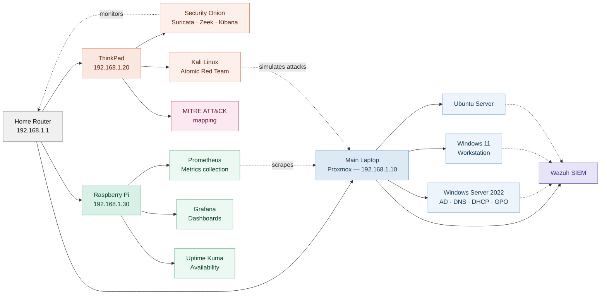

# Cybersecurity Homelab — Architecture Diagram

**Network:** 192.168.1.0/24

## Device inventory

| Device | Role | IP | Key software |
|---|---|---|---|
| Main Laptop (Proxmox) | Enterprise environment | 192.168.1.10 | Windows Server 2022, Windows 11, Ubuntu Server, Wazuh SIEM |
| ThinkPad | Attack simulation and NSM | 192.168.1.20 | Security Onion, Kali Linux, Atomic Red Team |
| Raspberry Pi | Monitoring | 192.168.1.30 | Grafana, Prometheus, Uptime Kuma |

## Traffic key

| Line | Meaning |
|---|---|
| Solid arrow | Direct control or data flow |
| Dashed arrow | Monitoring or simulated attack traffic |